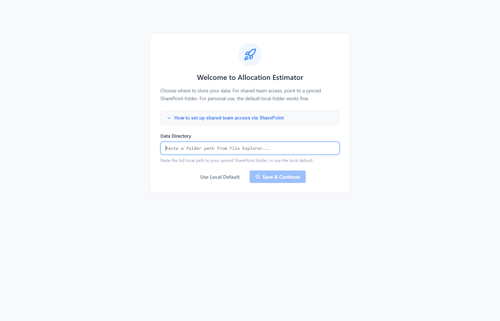
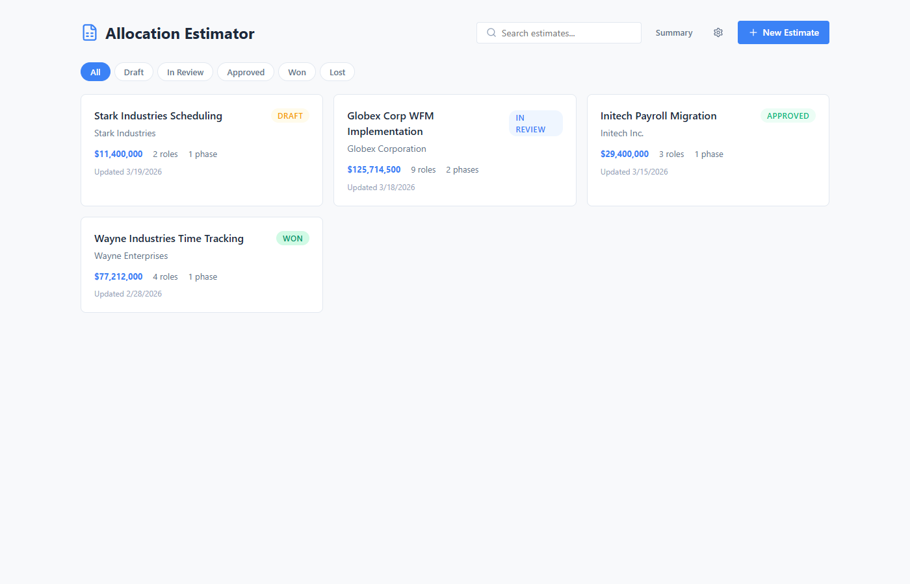
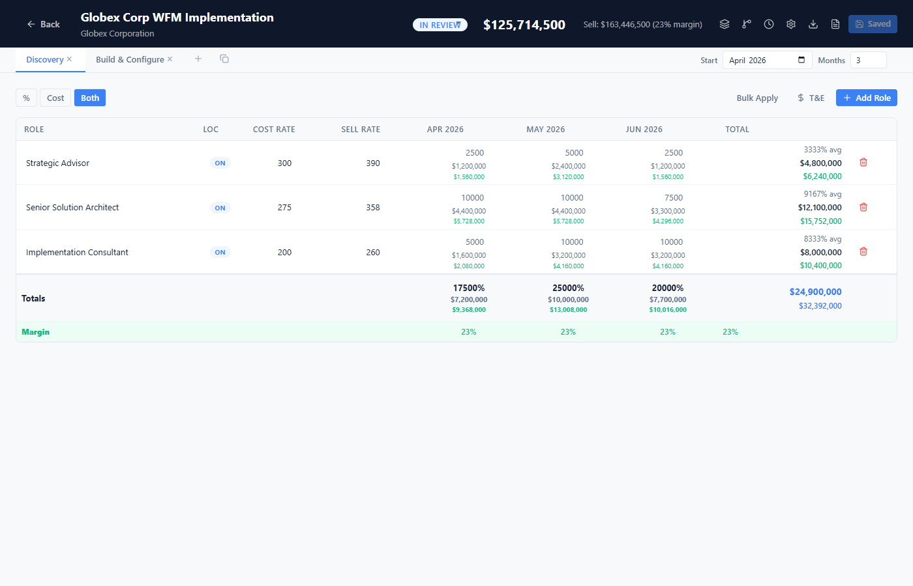
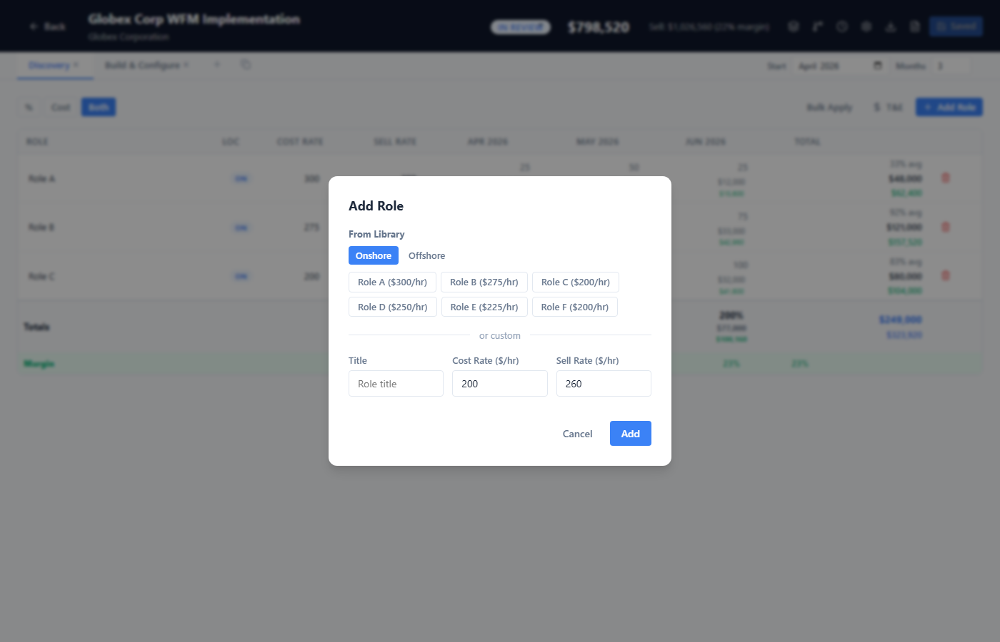
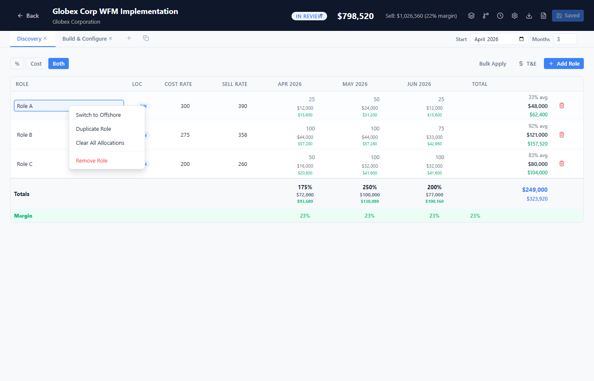
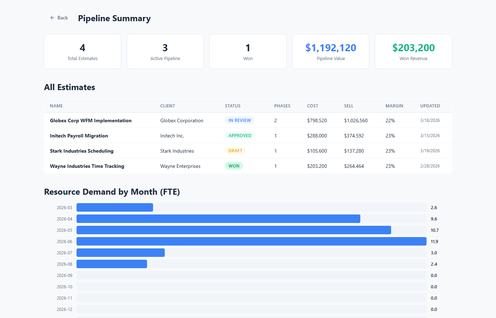
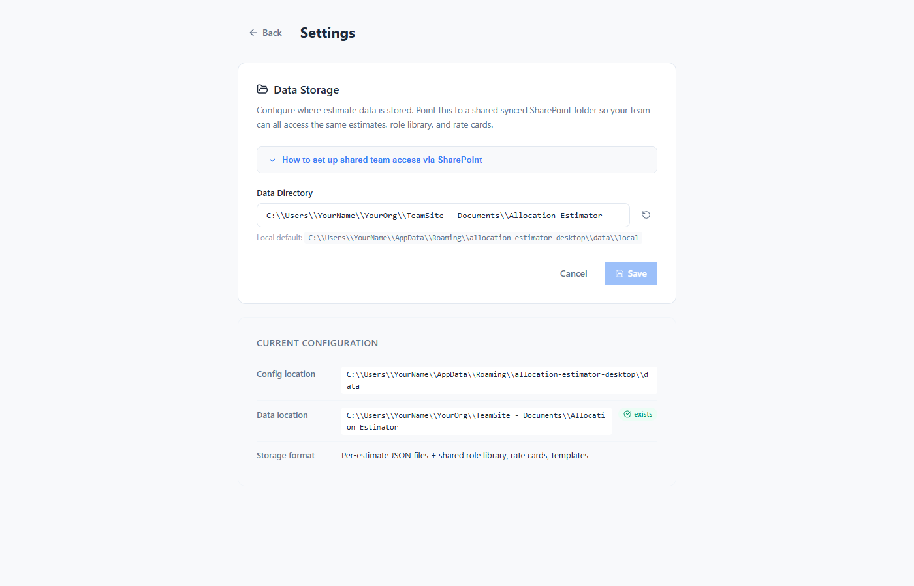
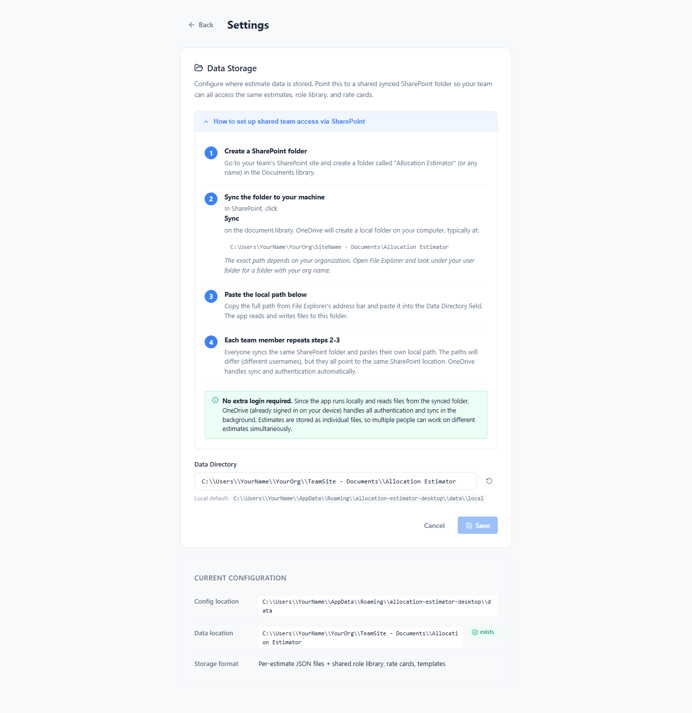

# Allocation Estimator — User Guide

## Table of Contents

1. [Getting Started](#getting-started)
2. [Dashboard](#dashboard)
3. [Creating an Estimate](#creating-an-estimate)
4. [The Estimate Editor](#the-estimate-editor)
5. [The Allocation Grid](#the-allocation-grid)
6. [Roles and Rates](#roles-and-rates)
7. [Onshore and Offshore Resources](#onshore-and-offshore-resources)
8. [Phases](#phases)
9. [Margin and Sell Rates](#margin-and-sell-rates)
10. [Travel and Expenses](#travel-and-expenses)
11. [Bulk Operations](#bulk-operations)
12. [Context Menus](#context-menus)
13. [Cell Notes](#cell-notes)
14. [Version History](#version-history)
15. [Role Templates](#role-templates)
16. [Role Library](#role-library)
17. [Scenarios](#scenarios)
18. [Exporting](#exporting)
19. [Summary Dashboard](#summary-dashboard)
20. [Settings](#settings)
21. [Keyboard Shortcuts](#keyboard-shortcuts)
22. [Troubleshooting](#troubleshooting)

---

## Getting Started

When you first launch the app, you'll see a **setup wizard** asking where to store your data.



- **For personal use:** Click "Use Local Default" — data is stored on your machine only.
- **For team use:** Paste the local path to a synced SharePoint folder. See the expandable guide in the setup wizard for step-by-step instructions.

### Initialize Data Directory

If this is a **brand-new data directory** (first-time setup or setting up a new shared folder), check **"Initialize this data directory with starter files"**. This creates:

- `role-library.json` — A starter role library with generic roles and rates you can customize.
- `rate-cards.json` — An empty rate cards file ready for your team's rate cards.
- `role-templates.json` — Starter role templates for common project types.

> **Important:** Only the **first person** setting up a shared directory should check this box. Subsequent team members pointing to the same shared directory should leave it unchecked — the files will already exist from the first person's setup. If files already exist, they will not be overwritten.

After setup, you'll land on the **Dashboard**.

---

## Dashboard

The dashboard is your home screen. It shows all your estimates as cards.



### Features

- **Search bar** — Filter estimates by name or client.
- **Status filter tabs** — Show All, Draft, In Review, Approved, Won, or Lost.
- **New Estimate** button — Create a new blank estimate.
- **Summary** button — Open the pipeline summary dashboard.
- **Settings** (gear icon) — Open application settings.

### Estimate Cards

Each card shows:
- Estimate name and client
- Status badge (color-coded)
- Total cost
- Number of roles and phases
- Last updated date
- Scenarios (if any)

### Card Actions

Click on a card to open it. The action buttons at the bottom of each card:
- **Branch icon** — Create a new scenario from this estimate.
- **Copy icon** — Duplicate the estimate.
- **Trash icon** — Delete the estimate (with confirmation).

---

## Creating an Estimate

1. Click **New Estimate** on the dashboard.
2. Enter an **Estimate Name** (e.g., "Acme Corp WFM Implementation").
3. Enter a **Client** name (e.g., "Acme Corporation").
4. Click **Create**.

You'll be taken directly to the Estimate Editor.

---

## The Estimate Editor

The editor is the main workspace for building your estimate.



### Header

- **Back arrow** — Return to the dashboard.
- **Estimate name** — Click to edit.
- **Client name** — Click to edit.
- **Status dropdown** — Change the estimate's status (Draft, In Review, Approved, Won, Lost).
- **Total cost** — Always visible.
- **Sell total and margin** — Visible when margin mode is enabled.

### Toolbar Buttons (right side)

| Icon | Action |
|------|--------|
| Layers | Toggle margin/sell visibility |
| Git Branch | Open role templates |
| Clock | Open version history |
| Gear | Open role library |
| Download | Export to Excel (.xlsx) |
| File | Export to PDF |
| Save | Manual save (auto-save also runs after 1 second of inactivity) |

---

## The Allocation Grid

The grid is the core of each phase. It shows roles as rows and months as columns.

### View Modes

Use the toggle buttons in the grid toolbar:
- **%** — Show allocation percentages only.
- **$** — Show cost amounts only.
- **Both** — Show percentages and costs together.

### Entering Allocations

Click on any cell and type a percentage (0-100). This represents the percentage of a full-time resource allocated for that month.

**Cost calculation:** Allocation % × Hourly Rate × 160 hours/month.

For example, a consultant at $200/hr allocated at 50% for a month = 0.50 × $200 × 160 = $16,000.

### Drag to Fill

Hover over the bottom-right corner of a cell to see the drag handle. Click and drag across months to fill the same allocation percentage into multiple cells.

---

## Roles and Rates

### Adding Roles

1. Click **Add Role** below the grid.
2. The modal shows your **role library** as clickable chips.
3. Click a library role to add it with pre-configured rates, OR fill in the custom fields:


   - **Title** — Role name.
   - **Cost Rate** — Internal hourly cost rate.
   - **Sell Rate** — Client-facing hourly rate (visible when margin mode is on).
4. Choose **Onshore** or **Offshore** using the toggle at the top.

### Editing Rates Inline

You can edit any role's title, cost rate, or sell rate directly in the grid by clicking the cell.

### Removing Roles

Click the red **×** button at the end of a role row, or right-click the role and select "Remove Role."

---

## Onshore and Offshore Resources

Each role has a **location badge** (ON or OFF) in the grid.

### Toggling Location

- Click the badge to switch between onshore and offshore.
- Rates automatically update from the role library (onshore rates ↔ offshore rates).

### How Rates Map

| Location | Cost Rate | Sell Rate |
|----------|-----------|-----------|
| Onshore  | Default Rate | Default Sell Rate |
| Offshore | Offshore Rate | Offshore Sell Rate |

Configure these in the **Role Library** (gear icon in the editor toolbar).

---

## Phases

Estimates can have multiple phases (e.g., Discovery, Build, Hypercare).

### Managing Phases

- **Phase tabs** appear above the grid. Click a tab to switch.
- **+ button** — Add a new blank phase.
- **Copy button** — Duplicate the current phase.
- **× button** — Remove a phase (disabled if there's only one).

### Phase Configuration

Below the phase tabs:
- **Start Month** — When this phase begins.
- **Months** — Duration (1-36 months).

Each phase has its own independent allocation grid, roles, and expenses.

---

## Margin and Sell Rates

### Enabling Margin View

Click the **Layers** icon in the editor toolbar to toggle margin visibility.

When enabled:
- A **Sell Rate** column appears for each role.
- **Sell totals** appear alongside cost totals.
- The **margin row** at the bottom shows margin percentage per month.
- The header shows: "Sell: $X (Y% margin)"

### Margin Calculation

```
Margin = (Sell - Cost) / Sell
```

---

## Travel and Expenses

Each phase can include T&E line items.

### Adding Expenses

1. Click the **T&E** button in the grid toolbar.
2. Click **Add Expense**.
3. Enter a **description** and **amount**.

Expenses are included in the phase and estimate totals.

---

## Bulk Operations

For quickly filling allocations across a range of months:

1. Click **Bulk Apply** in the grid toolbar.
2. Select a **Role** from the dropdown.
3. Enter the **Allocation %**.
4. Choose the **From** and **To** months.
5. Click **Apply**.

This fills every month in the range with the specified percentage.

---

## Context Menus

Right-click on different parts of the grid for quick actions.



### Role Row (right-click on role name)
- **Switch to Onshore/Offshore** — Toggle location.
- **Duplicate Role** — Create a copy with the same rates.
- **Clear All Allocations** — Zero out all months for this role.
- **Remove Role** — Delete the role.

### Cell (right-click on an allocation cell)
- **Add/Edit Note** — Attach a note to this cell.
- **Set 100%** — Set allocation to 100%.
- **Set 50%** — Set allocation to 50%.
- **Set 25%** — Set allocation to 25%.
- **Clear** — Set allocation to 0%.

### Month Header (right-click on a month column header)
- **Fill All 100%** — Set all roles to 100% for this month.
- **Fill All 50%** — Set all roles to 50% for this month.
- **Clear Column** — Clear all allocations for this month.

---

## Cell Notes

Add notes to individual cells for context (e.g., "Ramping up", "On PTO first two weeks").

### Adding a Note
- Right-click a cell → **Add Note**, or
- Click the note indicator dot on a cell that already has a note.

### Viewing Notes
Cells with notes show a small dot indicator. Hover or right-click to see and edit.

---

## Version History

Save named snapshots of your estimate and restore them later.

### Saving a Version

1. Click the **Clock** icon in the editor toolbar.
2. Enter a version name (e.g., "v1 - Initial draft").
3. Click **Save Version**.

### Restoring a Version

1. Open version history.
2. Click on a previous version to restore it.
3. The estimate will revert to that snapshot.

---

## Role Templates

Pre-configured sets of roles for common project types.

### Using a Template

1. Click the **Git Branch** icon in the editor toolbar.
2. Select a template (e.g., "Standard WFM Implementation").
3. The template's roles are added to the current phase.

### Default Templates

- **Standard WFM Implementation** — SA, PM, SSA, 3 Workstream Leads, 4 ICs.
- **Discovery Only** — SSA, Senior IC, IC.

Templates can be customized in the settings.

---

## Role Library

The shared library of roles and their standard rates.

### Accessing the Library

Click the **Gear** icon in the editor toolbar.

### Managing Roles

- Edit role titles, onshore cost/sell rates, and offshore cost/sell rates.
- Add new roles with the **Add Role** button.
- Remove roles with the trash icon.
- Click **Save** to persist changes.

The role library is shared — when using a shared data directory, all team members see the same library.

---

## Scenarios

Create alternative versions of an estimate to compare approaches.

### Creating a Scenario

1. On the dashboard, click the **Branch** icon on an estimate card.
2. A new scenario is created as a copy of the original.
3. Scenarios appear as badges on the parent estimate's card.

### Comparing Scenarios

Click on any scenario badge to open it. Use the Summary Dashboard to compare totals across all estimates and scenarios.

---

## Exporting

### PDF Export

Click the **File** icon in the editor toolbar.

The PDF includes:
- Estimate name, client, and status.
- Summary with total cost, sell, and margin.
- Per-phase allocation tables showing roles, rates, and monthly percentages.
- Travel & expenses (if any).

### Excel Export

Click the **Download** icon in the editor toolbar.

The Excel file includes:
- One sheet per phase.
- Allocation grid with monthly percentages.
- Cost grid with monthly dollar amounts.
- Travel & expenses section.

---

## Summary Dashboard

Access via the **Summary** button on the main dashboard.



### Statistics Cards

- **Total Estimates** — Count of all estimates.
- **Active Pipeline** — Estimates not yet won or lost.
- **Won** — Count of won estimates.
- **Pipeline Value** — Total cost of active estimates.
- **Won Revenue** — Total cost of won estimates.

### Estimates Table

A sortable table of all estimates showing name, client, status, phases, cost, sell, margin, and last updated date. Click any row to open that estimate.

### Resource Demand Chart

A horizontal bar chart showing aggregate FTE demand by month across all active estimates. Useful for capacity planning and identifying resource bottlenecks.

---

## Settings

Access via the **gear icon** on the dashboard, or at any time via the `/settings` route.



The settings page includes an expandable guide for setting up shared team access via SharePoint:



### Data Directory

The path where estimate data is stored. Change this to:
- A synced SharePoint/OneDrive folder for team access.
- A local folder for personal use.

### Initialize Data Directory

Check **"Initialize this data directory with starter files"** when pointing to a new, empty directory. This creates role-library.json, rate-cards.json, and role-templates.json with starter content. If any of these files already exist, they are skipped (not overwritten) and you'll see a warning listing which files were skipped.

The settings page shows your current configuration including the config file location, data location, and storage format.

### Current Configuration

- **Config location** — Where the app stores its settings (per-user, never shared).
- **Data location** — Where estimates and shared data are stored.
- **Storage format** — Per-estimate JSON files + shared role library, rate cards, and templates.

---

## Keyboard Shortcuts

| Shortcut | Action |
|----------|--------|
| **Ctrl+R** | Reload the application |
| **Ctrl+Shift+R** | Force reload |
| **Ctrl+U** | Pull latest updates from GitHub |
| **Ctrl+Q** | Quit the application |
| **Ctrl+F5** | Force reload (alternative) |

These shortcuts work in the Electron desktop app. In a browser, standard browser shortcuts apply.

---

## Troubleshooting

### Role library or templates are empty

The role library and templates are stored as files in your data directory. If they're empty, the data directory wasn't initialized.

**Fix:** Go to Settings (gear icon) → check "Initialize data directory" → Save. This copies starter files into your data directory without overwriting existing files.

### "Some files were skipped" warning

This appears when you check "Initialize data directory" on a directory that already has data files. Existing files are never overwritten.

- **If expected:** No action needed — your data is safe.
- **To reset to defaults:** Delete or rename the files in your data directory, then re-initialize.

### Different team members see different data

Verify that:
1. Everyone has synced the **same** SharePoint folder to their machine.
2. Each person's Settings → Data Directory points to their local copy of that synced folder.
3. OneDrive sync is active and not paused (check the OneDrive icon in the system tray).

### Data missing after app rebuild or reinstall

Your estimates and shared data live in the **data directory** (separate from the app). The app's config file at `%APPDATA%/allocation-estimator-desktop/data/config.json` remembers where your data is. If data seems missing:
1. Open Settings and verify the data directory path is correct.
2. Check that the data directory folder still exists.
3. If the config was lost, re-enter your data directory path — the data files should still be there.

### App shows "Could not load settings"

The Express server isn't running. This happens in browser-only mode (`npm run dev`). For full functionality:
- Use the desktop app (Electron), which starts the server automatically, or
- Run `npm run build && node server.cjs` for the full production server.

### OneDrive sync conflicts

If two people edit the **same estimate** simultaneously, OneDrive may create a conflict copy (e.g., `estimate-id-ConflictCopy.json`). To resolve:
1. Open both files in a text editor and merge the changes you want to keep.
2. Save the merged version as the original filename.
3. Delete the conflict copy.

> **Tip:** Conflicts are rare since each estimate is a separate file. Different people can work on different estimates simultaneously without issues.

---

## Tips

- **Auto-save** kicks in 1 second after your last change — no need to manually save.
- **Right-click everything** — context menus are available on roles, cells, and month headers.
- **Drag to fill** — grab the handle on a cell's bottom-right corner to copy allocations across months.
- **Bulk apply** is fastest for filling large ranges with the same allocation.
- **160 hours/month** is the standard used for all calculations. A 100% allocation = 160 billable hours.
